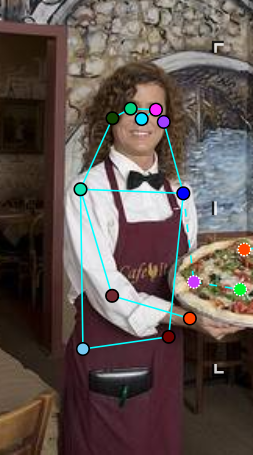
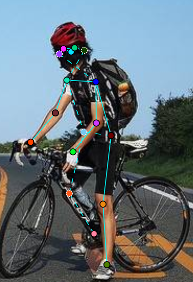
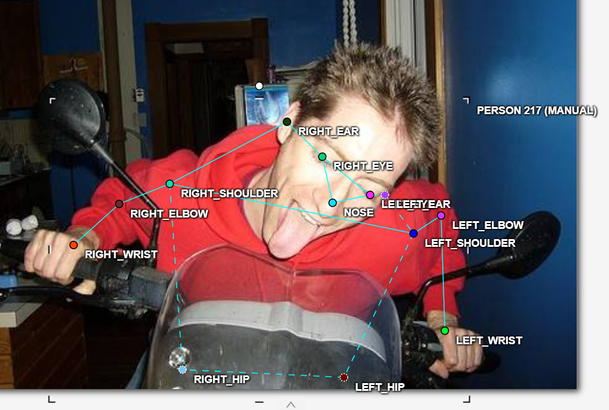
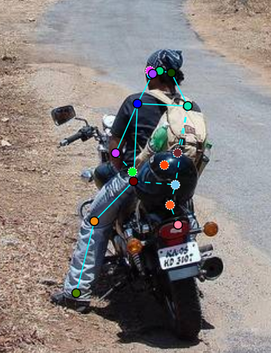
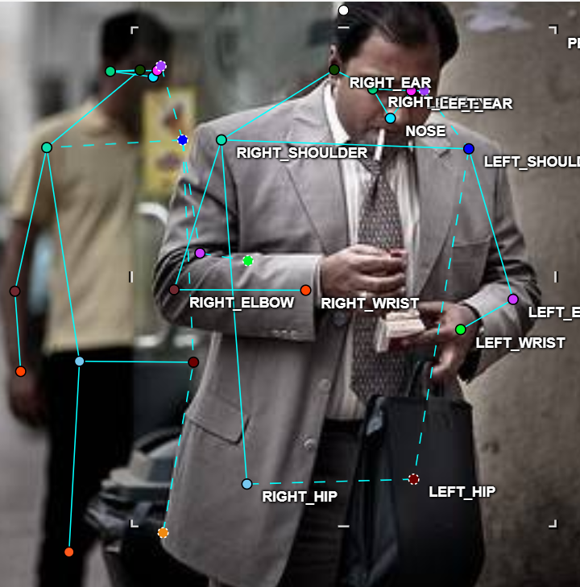
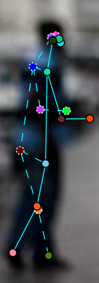

# Mini guideline - nhóm: Không có tên  |  người gán: Nguyễn Vũ Quang Minh  |  ngày: 16/09/2026

> Điền file này **trong lúc** gán nhãn, không phải sau khi xong. Mỗi lần bạn dừng lại
> hơn 10 giây để phân vân, đó là một dòng phải ghi vào đây.

## 1. Luật bắt buộc (đã thống nhất cả lớp - không sửa)

- Bộ 17 điểm COCO, đúng tên, đúng thứ tự. Lấy từ file `.SVG` chung.
- Mọi người trong ảnh đều có **đủ 17 điểm**. Điểm không dùng được thì gắn cờ, không xoá.
- Trái/phải tính theo **cơ thể người**, không theo bức ảnh.
- Bị che, còn trong khung -> `v = 1`, **vẫn đặt chấm** ở vị trí ước lượng.
- Ra ngoài mép ảnh -> `v = 0`, **không** đặt chấm.
- Không dùng `Hidden` (`h`) - nó không được lưu vào file.

## 2. Luật của nhóm bạn (phải điền)

| Tình huống | Luật nhóm bạn chọn | Vì sao |
| --- | --- | --- |
| Hông của người mặc quần áo dài | `Nếu mặc quần áo dài nhưng cả người vẫn đầy đủ/xác định được thì vẫn đánh dấu. Nếu bị che khuất nhưng đoán được thì để Occluded.` | `Vì khi đó vẫn đủ dữ kiện để xác minh hông của người đó.` |

| Tai bị tóc hoặc mũ bảo hiểm che một phần | `Bị che nếu như vẫn có thể dùng các bộ phận khác để xác định thì áng chừng rồi đánh dấu, đổi trạng thái thành Occluded.` | `Vì tai người ở một vài vị trí cố định nên có thể áng chừng được vị trí của tai dựa vào vị trí các bộ phận khác trên mặt.` |

| Người bị cắt ở mép ảnh (chỉ thấy từ hông trở lên) | `Chỉ đánh dấu từ hông trở lên, đầu gối và mắt cá chân để property là Outside` | `Vì không thể dự đoán được bộ phận người ở ngoài ảnh đó sẽ ra sao, thiếu nhiều dữ kiện để kết luận cũng như là áng chừng.` |

| Cổ tay nằm sau tay lái / sau thân mình | `Áng chừng và đánh dấu, gán Occluded nếu như bị che khuất` | `Có thể dựa vào cử chỉ để áng chừng dáng của cổ tay.` |

| Hai người chồng lên nhau | `Vẽ người bị chồng lên trước, những điểm nào bị chồng lên thì đánh dấu Occluded.` | `Cần đánh dấu để phân biệt skeleton của 2 người khác nhau` |

| Người nhỏ đến mức nào thì không gán nữa | `Quá mờ, không thể nhìn rõ tứ chi và mặt.` | `Khi đó sẽ không thể dự đoán được các điểm cần đoán.` |

Với mỗi luật, chèn **một ảnh mẫu** (screenshot từ CVAT) thay vì chỉ viết một câu.
Slide 12 nói rõ: khớp không có bề mặt nhìn thấy được thì phải có ảnh mẫu, không phải
một câu văn chung chung.

## 3. Ba ca mơ hồ đã gặp (bắt buộc, ghi ít nhất 3)

### Ca 1 - ảnh `train_11.jpg`, người thứ `235`, khớp `LEFT_HIP`

- Mơ hồ ở chỗ nào: thân dưới (từ hông) bị che khuất khỏi ảnh, cụ thể là bị che bởi bàn.
- Bạn quyết thế nào: Áng chừng và đưa ra điểm Occluded cho háng và chân.
- Vì sao: Người này đang ngồi, nên nhiều khả năng là hông và chân của họ sẽ ở cùng trong khung hình.
- Nếu người khác quyết ngược lại thì model học sai cái gì: Thì model học sai cách đoán điểm trong ảnh.

### Ca 2 - ảnh `train_10.jpg`, người thứ `217`, khớp `RIGHT_HIP`

- Mơ hồ ở chỗ nào: 2 phần hông đã bị che bởi đầu xe, không rõ ràng.
- Bạn quyết thế nào: Áng chừng dựa trên dáng ngồi của người.
- Vì sao: Vì người này đang ngồi xe máy, và có thể nhìn thấy được phần nhỏ của quần họ, nên có thể đoán được vị trí của hông khi ngồi lên trên yên xe.
- Nếu người khác quyết ngược lại thì model học sai cái gì: Có thể model sẽ học rằng khi người bị vậy khác đè lên thì sẽ bị khuyết, đứt gãy và mất khớp.

### Ca 3 - ảnh `train_13.jpg`, người thứ `307`, khớp `RIGHT_EAR`

- Mơ hồ ở chỗ nào: Dữ liệu người bị mờ, không rõ ràng nên khó xác định được đúng điểm của khớp tai.
- Bạn quyết thế nào: Dựa vào vị trí mũi và mắt phải, áng chừng đặt điểm cho tai phải.
- Vì sao: Vì model không thể chính xác tới từng pixel mà chỉ tới điểm, vậy nên xác định đúng vị trí sẽ tốt hơn là đúng tới pixel.
- Nếu người khác quyết ngược lại thì model học sai cái gì: Model sẽ học không dự đoán các điểm của tai khi dữ liệu bị mờ, chất lượng kém.
